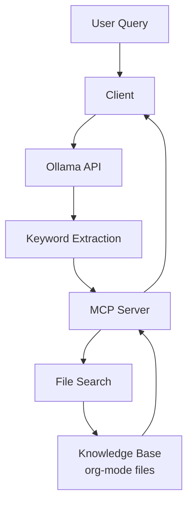
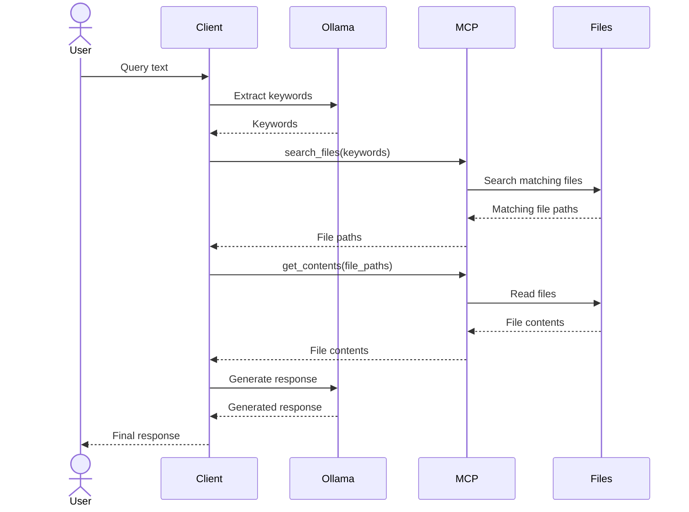

# Brain Knowledge System Design

## Overview
A system designed to process natural language queries and generate responses using local org-mode files as a knowledge base, integrating with an MCP server for file operations.

## Architecture



## Sequence



## Components

### 1. Client
- Handles query processing workflow
- Integrates with Ollama for NLP tasks
- Coordinates with MCP server for file operations

### 2. Ollama Integration
- Keyword extraction: Extracts relevant keywords from user queries
- Response generation: Generates responses based on searched file contents

### 3. MCP Server
- Tool: search_files
  - Input: Keywords from query
  - Output: List of relevant file paths
  - Features: Parallel search, relevance sorting
- Tool: get_contents
  - Input: List of file paths
  - Output: File contents
  - Features: Content retrieval and formatting

## Configuration

Configuration file: `~/.config/brain/config.toml`

```toml
[ollama]
endpoint = "http://localhost:11434"
model = "mistral"
max_context_length = 4096

[knowledge]
root_path = "/path/to/org/files"
max_files = 5  # Maximum number of files for search results

[mcp]
server_name = "brain-files"  # MCP server identifier
```

## Error Handling

- File search failure: Return error with details
- Content retrieval failure: Return partial results if available
- Configuration file issues: Startup error with config validation

## Future Enhancements

1. org-mode file structure parsing
2. Advanced scoring algorithms
   - TF-IDF
   - BM25
   - Document embedding
3. Search result caching
4. Learning from user feedback
