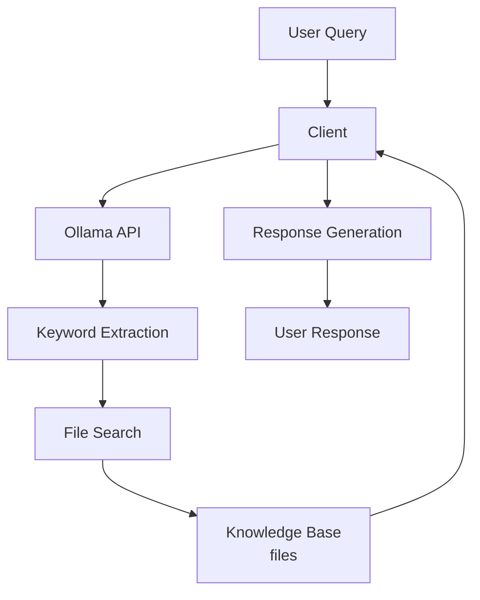
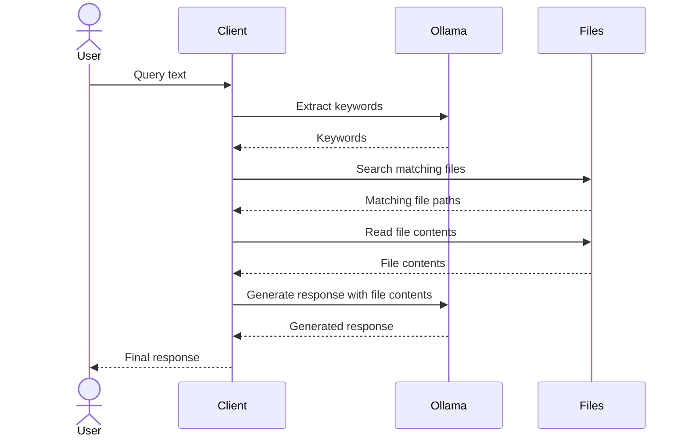

# Brain Knowledge System Design

## Overview
A system designed to process natural language queries and generate responses using local files as a knowledge base, with a unified client handling all operations.

## Architecture



## Sequence



## Components

### 1. Client
- CLI program that handles the entire query processing workflow
- Accepts natural language queries from users
- Integrates with Ollama for NLP tasks
- Performs file search operations
- Retrieves file contents
- Can stop processing after file search based on CLI arguments

### 2. Ollama Integration
- Keyword extraction: Extracts relevant words from user queries
- Response generation: Generates responses based on searched file contents as context

### 3. File Operations
- Search functionality: 
  - Input: Keywords from query
  - Output: List of relevant file paths
  - Features: Relevance sorting based on keyword matches
- Content retrieval:
  - Input: List of file paths
  - Output: File contents
  - Features: Content retrieval and formatting

## Configuration

Configuration file: `~/.config/brain/config.toml`

```toml
[ollama]
endpoint = "http://localhost:11434"
model = "mistral"
max_context_length = 4096

[knowledge]
root_path = "/path/to/files"
max_files = 5  # Maximum number of files for search results
```

## CLI Usage

```
brain [OPTIONS] <QUERY>

OPTIONS:
  --mode <MODE>    Operation mode: extract-only, search-only, or generate-response (default: generate-response)
                   extract-only: Only extract and display search terms
                   search-only: Extract terms and find matching files
                   generate-response: Complete workflow including response generation
  --max-files N    Override the maximum number of files to use (default from config)
  --config PATH    Specify an alternative config file path
  --help           Display help information
```

## Error Handling

- File search failure: Return error with details
- Content retrieval failure: Return partial results if available
- Configuration file issues: Startup error with config validation

## Future Enhancements

1. Advanced file structure parsing
2. Advanced scoring algorithms
   - TF-IDF
   - BM25
   - Document embedding
3. Search result caching
4. Learning from user feedback
