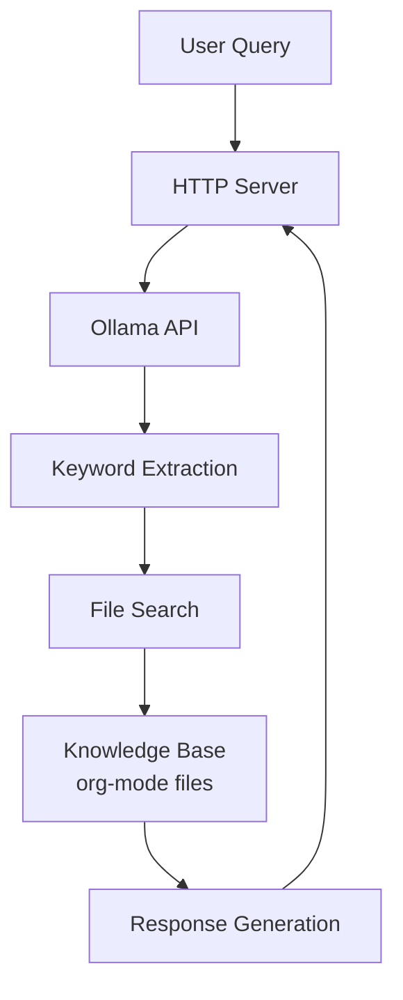

# Brain Knowledge System Design

## Overview
The Brain Knowledge System is designed to process natural language queries from users and generate appropriate responses using local org-mode files as a knowledge base.

## Architecture



## Components

### 1. HTTP Server
- Based on axum framework
- Handles JSON requests/responses
- Endpoint: `http://localhost:3000/api/query`

### 2. Ollama Integration
- Keyword extraction: Extracts relevant keywords from user queries
- Response generation: Generates responses based on searched file contents

### 3. File Search
- Uses `rg` (ripgrep) command
- Parallel keyword-based search
- File sorting based on relevance

## API Interface

### Query Endpoint
- **URL**: `/api/query`
- **Method**: POST
- **Request Format**:
  ```json
  {
    "text": "Natural language query"
  }
  ```
- **Response Format**:
  ```json
  {
    "answer": "Generated response",
    "file_paths": ["Referenced file paths"],
    "error_message": "Error message (optional)"
  }
  ```

## Configuration

Configuration file: `~/.config/brain/config.toml`

```toml
[ollama]
endpoint = "http://localhost:11434"
model = "mistral"
max_context_length = 4096

[knowledge]
root_path = "/path/to/org/files"
max_files = 5  # Maximum number of files for search results

[search]
ripgrep_path = "/usr/bin/rg"
parallel_searches = 4  # Number of parallel searches
```

## Processing Flow

1. **Keyword Extraction**
   - Input: User's natural language query
   - Process: Keyword extraction using Ollama
   - Output: List of relevant keywords

2. **File Search**
   - Input: Extracted keywords
   - Process: Parallel execution of rg commands
   - Output: List of relevant file paths (sorted by score)

3. **Response Generation**
   - Input: Contents of searched files
   - Process: Response generation using Ollama
   - Output: Natural language response

## Error Handling

- File search failure: Immediate error return
- Response generation failure: Return file paths list only
- Configuration file issues: Startup error

## Future Enhancements

1. org-mode file structure parsing
2. Advanced scoring algorithms
   - TF-IDF
   - BM25
   - Document embedding
3. Search result caching
4. Learning from user feedback
